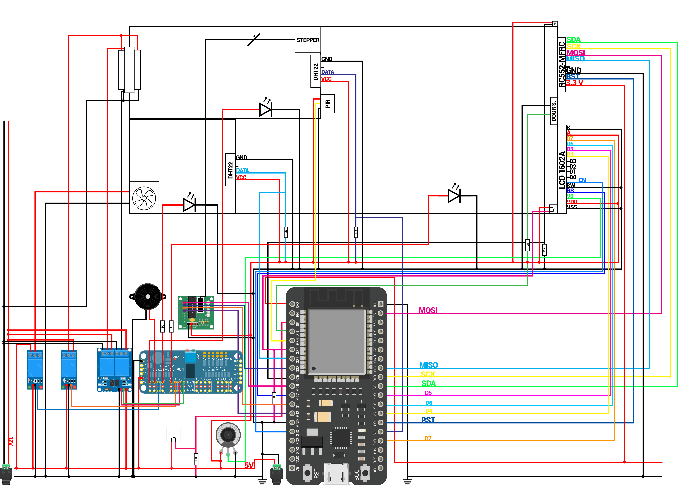

# Önlab
Önálló labóratórium, 6. félév
## Okos otthon modell
Használt eszközök:
- ESP32 38 pin
- LCD 1602A
- RFID RC522
- PIR motion detector
- 2x DHT22 humidity and temperature sensor
- BUZZER (alarm)
- Electro Magnetic Door Sensor
- LEDs (2x Living Room, 1x Bathroom, 1x Bedroom)
- 5V FAN (in the bathroom)
- STEPPER MOTOR 28BYJ-48 and ULN2003 driver
- 2x 12V FAN in the bedroom (heat fan)
- Peltier module
- 2x Buttons (LCD switcher and light switcher)
- PCA9685 16-Channel Servo Driver (used for external output)
- 2x 5V 1CH Relay (1x Bathroom Fan Switch, 1x Heat Fan Switch)
- 1x 5V 2CH Relay (Polarity switch for the peltier)

A félév során elkészült okosotthon kapcsolási rajza:
